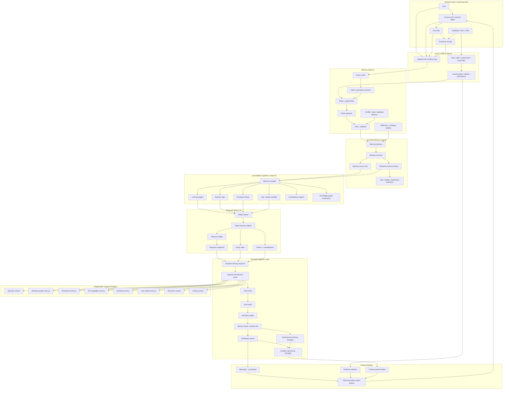
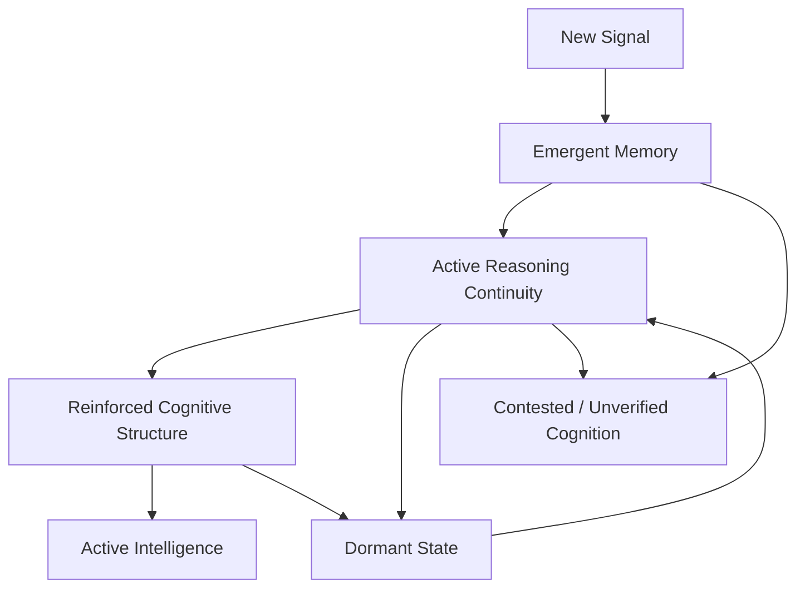
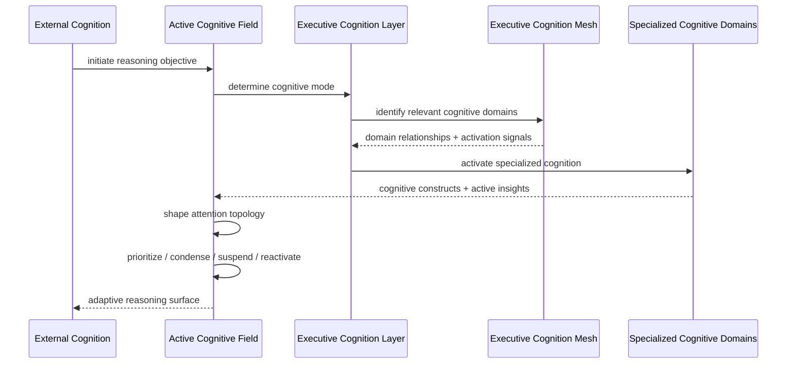

# Adaptive Cognitive Fabric (ACF)

This document defines the architecture for a persistent adaptive cognitive runtime built around a frozen reasoning model.

The system is not:

- a vector database
- a chat history manager
- a single RAG pipeline
- a static memory graph

It is:

> a cognitive operating layer that manages memory as structured runtime cognition.

The core design principles are:

- memory is partitioned into independent cognitive regions
- context is activated dynamically instead of globally loaded
- runtime cognition is separated from persistent truth
- memory is built, compiled, activated, sculpted, and evolved
- different tasks use different memory architectures
- memory policies are learned independently from model weights

---

# 1. Core System Shape

```text
raw evidence
    -> memory daemon
    -> memory patches
    -> versioned memory source
    -> consolidated cognitive constructs
    -> temporal memory IR
    -> runtime cognitive activation
    -> sculpted working memory
    -> external reasoning model
    -> new evidence
```

The runtime should behave more like:

- an operating system
- a compiler runtime
- a cognitive scheduler

than a retrieval system.

---

# 2. Full Architecture



---



```mermaid
flowchart TD

%% =========================================================
%% EXTERNAL INTERACTION
%% =========================================================

subgraph External["External Interaction"]
    USER["User"]
    AGENT["Reasoning Model / Agent"]
    TOOLS["Tools / APIs"]
    RESULTS["Execution Results"]
    WORLD["Files / Docs / Environment"]
end

%% =========================================================
%% COGNITIVE FOUNDATION
%% =========================================================

subgraph Foundation["Cognitive Foundation Layer"]

    subgraph Perception["Perception + Evidence"]
        STREAM["Observation Stream"]
        RAW["Raw Evidence Objects"]
        TRACE["Trace + Provenance Records"]
    end

    subgraph Consolidation["Memory Consolidation Engine"]
        DETECT["Pattern + Event Detection"]
        RELATE["Relation + Entity Binding"]
        SYNTH["Knowledge Synthesis"]
        REVIEW["Consistency + Trust Analysis"]
        REFLECT["Reflection + Distillation"]
    end

    subgraph Chronicle["Persistent Cognitive Chronicle"]
        DELTAS["Cognitive Deltas"]
        STATES["Persistent Cognitive State"]
        TIMELINE["Temporal Knowledge History"]
        FORKS["Task / Project Timelines"]
    end

    subgraph Synthesis["Cognitive Synthesis Layer"]
        MODELS["Structured Cognitive Models"]
        SNAPS["Temporal Cognitive Snapshots"]
        GRAPH["Knowledge Spine"]
        INDEX["Entity + Concept Index"]
    end

end

%% =========================================================
%% GLOBAL Cognitive SystemS
%% =========================================================

subgraph MemorySystems["Global Cognitive Systems"]

    EPISODIC["Episodic Cognitive System"]
    SEMANTIC["Semantic Cognitive System"]
    PROCEDURAL["Procedural Cognitive System"]
    WORKING["Working Cognitive System"]
    TOOLMEM["Tool Capability Memory"]
    PROFILE["Profile + Preference Memory"]
    META["Meta-Cognitive System"]

end

%% =========================================================
%% EXECUTIVE ORCHESTRATION
%% =========================================================

subgraph Executive["Executive Cognitive Orchestrator"]

    MODE["Cognitive Mode Selector"]
    ALLOC["Attention + Token Allocation"]
    MEDIATE["Cross-Context Mediation"]
    POLICY["Adaptive Memory Policies"]
    SPECIALIZE["Specialized Cognitive Domain (subcontext) Formation Engine"]

end

%% =========================================================
%% DYNAMIC Specialized Cognitive Domain (subcontext) SYSTEM
%% =========================================================

subgraph Contexts["Dynamic Cognitive Subcontexts"]

    CODECTX["Coding Specialized Cognitive Domain (subcontext)"]
    RESEARCHCTX["Research Specialized Cognitive Domain (subcontext)"]
    PLANCTX["Planning Specialized Cognitive Domain (subcontext)"]
    SOCIALCTX["Social / Conversation Specialized Cognitive Domain (subcontext)"]

    EMERGENT["Emergent Specialized Contexts"]

end

%% =========================================================
%% LOCAL RUNTIME COGNITION
%% =========================================================

subgraph Runtime["Local Runtime Cognition"]

    subgraph CodingRuntime["Coding Runtime"]
        C_ACT["Local Activation"]
        C_MEM["Local Working Set"]
        C_FOCUS["Context Sculpting"]
    end

    subgraph ResearchRuntime["Research Runtime"]
        R_ACT["Local Activation"]
        R_MEM["Local Working Set"]
        R_FOCUS["Context Sculpting"]
    end

    subgraph PlanningRuntime["Planning Runtime"]
        P_ACT["Local Activation"]
        P_MEM["Local Working Set"]
        P_FOCUS["Context Sculpting"]
    end

    subgraph SocialRuntime["Social Runtime"]
        S_ACT["Local Activation"]
        S_MEM["Local Working Set"]
        S_FOCUS["Context Sculpting"]
    end

    subgraph EmergentRuntime["Emergent Specialized Runtime"]
        E_ACT["Adaptive Activation"]
        E_MEM["Specialized Working Set"]
        E_FOCUS["Adaptive Sculpting"]
    end

end

%% =========================================================
%% CONTEXT SYNTHESIS
%% =========================================================

subgraph Delivery["Reasoning Context Synthesis"]

    LOCAL["Local Cognitive Outputs"]
    NEGOTIATE["Cross-Context Negotiation"]
    FINAL["Unified Reasoning Context"]

end

%% =========================================================
%% EXTERNAL FLOWS
%% =========================================================

USER --> AGENT
AGENT --> TOOLS
TOOLS --> RESULTS
WORLD --> RESULTS

USER --> STREAM
AGENT --> STREAM
TOOLS --> STREAM
RESULTS --> STREAM
WORLD --> RAW

%% =========================================================
%% FOUNDATION FLOWS
%% =========================================================

STREAM --> DETECT
RAW --> TRACE

DETECT --> RELATE
RELATE --> SYNTH
SYNTH --> REVIEW
REVIEW --> DELTAS
REFLECT --> DELTAS

DELTAS --> STATES
STATES --> TIMELINE
TIMELINE --> FORKS

STATES --> MODELS
TIMELINE --> SNAPS
MODELS --> GRAPH
MODELS --> INDEX

%% =========================================================
%% Cognitive System FLOWS
%% =========================================================

MODELS --> EPISODIC
MODELS --> SEMANTIC
MODELS --> PROCEDURAL
MODELS --> WORKING
MODELS --> TOOLMEM
MODELS --> PROFILE
MODELS --> META

%% =========================================================
%% EXECUTIVE FLOWS
%% =========================================================

GRAPH --> MODE
INDEX --> MODE

MODE --> ALLOC
ALLOC --> MEDIATE
MEDIATE --> POLICY
POLICY --> SPECIALIZE

%% =========================================================
%% Specialized Cognitive Domain (subcontext) ACTIVATION
%% =========================================================

MODE --> CODECTX
MODE --> RESEARCHCTX
MODE --> PLANCTX
MODE --> SOCIALCTX

SPECIALIZE --> EMERGENT

%% =========================================================
%% MEMORY INJECTION INTO SUBCONTEXTS
%% =========================================================

EPISODIC --> CODECTX
SEMANTIC --> CODECTX
PROCEDURAL --> CODECTX
TOOLMEM --> CODECTX
META --> CODECTX

EPISODIC --> RESEARCHCTX
SEMANTIC --> RESEARCHCTX
META --> RESEARCHCTX

SEMANTIC --> PLANCTX
PROCEDURAL --> PLANCTX
META --> PLANCTX

PROFILE --> SOCIALCTX
EPISODIC --> SOCIALCTX
META --> SOCIALCTX

EPISODIC --> EMERGENT
SEMANTIC --> EMERGENT
PROCEDURAL --> EMERGENT
META --> EMERGENT

%% =========================================================
%% LOCAL RUNTIME FLOWS
%% =========================================================

CODECTX --> CodingRuntime
RESEARCHCTX --> ResearchRuntime
PLANCTX --> PlanningRuntime
SOCIALCTX --> SocialRuntime
EMERGENT --> EmergentRuntime

C_ACT --> C_MEM
C_MEM --> C_FOCUS

R_ACT --> R_MEM
R_MEM --> R_FOCUS

P_ACT --> P_MEM
P_MEM --> P_FOCUS

S_ACT --> S_MEM
S_MEM --> S_FOCUS

E_ACT --> E_MEM
E_MEM --> E_FOCUS

%% =========================================================
%% CONTEXT OUTPUT
%% =========================================================

C_FOCUS --> LOCAL
R_FOCUS --> LOCAL
P_FOCUS --> LOCAL
S_FOCUS --> LOCAL
E_FOCUS --> LOCAL

LOCAL --> NEGOTIATE
NEGOTIATE --> FINAL
FINAL --> AGENT

%% =========================================================
%% FEEDBACK LOOP
%% =========================================================

AGENT --> STREAM

%% =========================================================
%% SELF-SPECIALIZATION LOOP
%% =========================================================

CODECTX --> SPECIALIZE
RESEARCHCTX --> SPECIALIZE
PLANCTX --> SPECIALIZE
SOCIALCTX --> SPECIALIZE

SPECIALIZE -->|"Repeated Task Detection"| EMERGENT
```

# 3. Core Principle: Context Locality

The system must never maintain:

```text
one global universal context
```

Instead:

```text
multiple isolated cognitive regions
```

with:

- controlled activation
- scoped visibility
- dynamic routing
- runtime orchestration

The master runtime should know:

- which contexts exist
- when to activate them
- how they relate

But:

> the actual memory content should live inside the Specialized Cognitive Domain (subcontext) itself.

---

# 4. Cognitive Region Model

Every Specialized Cognitive Domain (subcontext) is an independent cognitive region.

Each region has:

```ts
type CognitiveRegion = {
  id: string;
  type:
    | "episodic"
    | "semantic"
    | "procedural"
    | "tool"
    | "working"
    | "profile"
    | "research"
    | "coding";

  scope: "global" | "user" | "project" | "task" | "branch";

  activationScore: number;
  utilityScore: number;
  tokenCost: number;
  visibility: "active" | "hidden" | "suppressed" | "cold" | "quarantine";

  retrievalPolicyId: string;
  compressionPolicyId: string;
  graphLinks: string[];
};
```

---

# 5. Memory Types

## 5.1 Episodic Memory

Inspired by:

- FLEX
- Memento
- MemRL

Stores:

- trajectories
- sessions
- task outcomes
- interaction histories

Example:

```ts
Episode {
  task: "Fix websocket issue"
  trajectory: [...]
  reward: 0.91
  outcome: "success"
}
```

Best for:

- workflow reuse
- debugging
- retrieval of similar experiences

---

## 5.2 Semantic Memory

Inspired by:

- Hindsight
- Structural Memory

Implemented as:

```text
knowledge graph backbone
```

Stores:

- entities
- relationships
- facts
- abstractions
- beliefs

Example:

```text
(API) --requires--> (Authentication)
(User) --likes--> (Mountain trips)
```

Best for:

- reasoning
- personalization
- long-term consistency

---

## 5.3 Procedural Memory

Inspired by:

- LEGOMem
- ACE
- ReasoningBank

Stores:

- reusable workflows
- modular procedures
- execution chains

Example:

```text
open_excel
    ↓
export_csv
    ↓
send_email
```

Best for:

- coding
- automation
- planning
- task execution

---

## 5.4 Tool Capability Memory

Inspired by:

- ToolMem

Stores:

- tool strengths
- tool weaknesses
- capability conditions
- routing heuristics

Example:

```text
Claude → long context
GPT → coding
OCR → scanned PDFs
```

---

## 5.5 Working Memory

Inspired by:

- Sculptor
- ACON

Stores:

- temporary active reasoning state
- focus regions
- active constraints
- short-term task state

Working memory is:

- temporary
- mutable
- sculpted dynamically

It is NOT durable truth.

---

# 6. Master Context Graph

The master layer should NOT store full memory.

It should store:

```text
routing metadata
activation conditions
context summaries
graph relationships
utility scores
visibility states
```

Example:

```ts
MasterContextNode = {
  regionId: "coding_context_17",
  type: "procedural",
  topics: ["websocket", "FastAPI"],
  utility: 0.91,
  linkedRegions: ["tool_context_4"],
};
```

The master graph behaves like:

```text
cognitive scheduler + activation map
```

NOT:

```text
universal memory dump
```

---

# 7. Knowledge Graph Backbone

The KG is the cognitive spine of the system.

The KG connects:

- users
- tasks
- tools
- procedures
- entities
- projects
- memories
- sessions
- decisions

Example:

```text
(User)
   ↓ likes
(Himachal trips)

(Task)
   ↓ solved_by
(Procedure: websocket_retry)

(Tool)
   ↓ best_for
(Long PDF summarization)
```

The KG should support:

- graph traversal
- temporal reasoning
- provenance tracing
- contradiction tracking
- dependency analysis

---

# 8. Dynamic Cognitive Routing

Inspired by:

- MemEvolve
- LEGOMem

The system must NEVER use one universal retrieval architecture.

Instead:

```text
Task
  ↓
Determine cognitive mode
  ↓
Select memory architecture
  ↓
Activate cognitive regions
```

---

# Example Routing

| Task Type     | Preferred Regions            |
| ------------- | ---------------------------- |
| Coding        | procedural + episodic + tool |
| Research      | semantic + KG + reasoning    |
| Planning      | procedural + semantic        |
| Conversation  | profile + episodic           |
| Tool-heavy    | Tool capability memory       |
| Long sessions | working memory manager       |

---

# 9. Runtime Activation Graph

The runtime operates on:

```text
activation graph
```

NOT:

```text
top-k chunk retrieval
```

Activation graph responsibilities:

- activate relevant regions
- suppress unrelated regions
- manage references
- control prompt inclusion
- maintain reasoning locality

---

# Runtime Reference Types

| Ref Type    | Meaning                      |
| ----------- | ---------------------------- |
| strong      | must stay active             |
| weak        | reachable if needed          |
| scoped      | visible only in task/project |
| derived     | inferred relation            |
| provenance  | evidence-backed              |
| invalidates | marks stale/conflicted       |
| watcher     | rebuild/reverify trigger     |

---

# 10. Sculptor-Style Active Context Management

Inspired by:

- Sculptor
- ACON

These operations belong inside runtime.

NOT persistent storage.

---

# Supported Operations

## focus()

Bring region into active context.

```python
focus("CodingContext")
```

---

## hide()

Remove from prompt while keeping reachable.

```python
hide("TravelContext")
```

---

## suppress()

Reduce retrieval probability.

```python
suppress("OldResearchContext")
```

---

## restore()

Bring hidden region back.

```python
restore("TravelContext")
```

---

## fold()

Compress region into summarized form.

```python
fold("LongConversation")
```

---

## fragment()

Split large region into smaller cognitive regions.

```python
fragment("CodingContext")
```

Result:

```text
- websocket_fragment
- auth_fragment
- UI_fragment
```

---

## merge()

Combine related fragments.

---

## pin()

Force inclusion into working memory.

```python
pin("critical_constraints")
```

---

## release()

Allow activation decay.

---

## verify()

Require evidence validation before use.

---

## delete()

Permanent removal.

Deletion must:

- remove embeddings
- remove graph edges
- invalidate references
- preserve audit logs if policy requires

---

# 11. Memory Visibility States

Every memory object and region should have visibility state.

| State                | Meaning                           |
| -------------------- | --------------------------------- |
| active               | currently in working memory       |
| hidden               | removed from prompt but reachable |
| suppressed           | low-priority                      |
| dormant              | archived inactive memory          |
| contested/unverified | conflicted or unsafe              |
| deleted              | removed by retention policy       |

---

# 12. Generational Memory Lifecycle

Inspired by:

- JVM GC
- Sculptor
- ReMe



---

# Generation Meanings

| Generation | Meaning                    |
| ---------- | -------------------------- |
| Nursery    | fresh, unverified          |
| Young      | recently useful            |
| Mature     | trusted, repeatedly useful |
| Old        | distilled invariant        |
| Cold       | dormant but preserved      |
| Quarantine | conflic/confidence issue   |

---

# 13. RL-Based Memory Policies

Inspired by:

- MemRL
- Memento
- Memento-II

RL should optimize:

```text
Cognitive System behavior
```

NOT:

```text
LLM weights
```

---

# RL Targets

## Retrieval Policy

```text
Which memory should activate?
```

---

## Compression Policy

```text
What should be folded?
```

---

## Verification Policy

```text
What requires evidence validation?
```

---

## Persistence Policy

```text
What deserves long-term promotion?
```

---

## Utility Policy

```text
Which memories are valuable?
```

---

# Example Utility Score

```python
score = (
    similarity
    + utility
    + recency
    + confidence
    + task_match
    - token_cost
    - staleness_penalty
)
```

---

# 14. Reflection + Distillation Layer

Inspired by:

- ReasoningBank
- ReMe
- ACE

Purpose:

```text
convert raw experiences into reusable intelligence
```

Pipeline:

```text
experience
    ↓
reflection
    ↓
failure/success comparison
    ↓
strategy extraction
    ↓
distilled memory update
```

Example:

From:

```text
10 websocket debugging sessions
```

Extract:

```text
"retry + keepalive solves most idle disconnects"
```

---

# 15. Multi-Agent Cognitive Views

Inspired by:

- LEGOMem

Each agent should see:

```text
filtered cognitive regions
```

NOT universal memory.

---

# Example

| Cognitive Role         | Accessible Domains                        |
| ---------------------- | ----------------------------------------- |
| Strategic Cognition    | conceptual knowledge + execution patterns |
| Execution Cognition    | operational workflows + tool intelligence |
| Reflective Cognition   | experiential history + conflict topology  |
| Identity Cognition     | preference model + continuity graph       |
| Verification Cognition | provenance signals + validation streams   |

---

# 16. Runtime Query Flow



---

# 17. Foundational Cognitive Principles

## Principle 1

Active cognition must never directly rewrite persistent truth.

Only:

evaluation → reconciliation → continuity integration

can alter persistent cognitive continuity.

---

## Principle 2

Inactive cognition is not invalid cognition.

Dormant cognitive domains:

- may still remain accurate
- may regain relevance under future reasoning states
- should preserve continuity unless explicitly invalidated

---

## Principle 3

No persistent cognition is established without grounding signals.

Long-term cognitive continuity requires:

- experiential support
- provenance anchors
- consistency validation
- reinforcement through repeated utility

---

## Principle 4

Every active cognitive construct must explain:

- why it is active
- what supports it
- when it became relevant
- what cognitive state preceded it

Reasoning visibility and continuity must remain interpretable.

---

## Principle 5

Different reasoning objectives require different cognitive architectures.

There is no universal cognition pipeline.

Cognitive orchestration must dynamically determine:

- active domains
- reasoning topology
- retrieval strategy
- synthesis strategy
- attention allocation

based on:

- task structure
- cognitive load
- continuity state
- experiential relevance

---

# 18. File Structure Sketch

```text
.cognition/

  signals/
    observations/
    interactions/
    tool-events/
    environment/
    provenance/

  continuity/
    entities/
    relationships/
    beliefs/
    timelines/
    identities/
    projects/

  domains/
    engineering/
    research/
    planning/
    social/
    tools/
    emergent/

  experiences/
    sessions/
    trajectories/
    outcomes/
    reflections/
    strategies/

  cognition/
    active-fields/
    attention-topologies/
    domain-runtime/
    focus-state/
    negotiation-state/

  synthesis/
    concepts/
    procedures/
    heuristics/
    distilled-insights/
    cognitive-patterns/

  intelligence/
    tool-intelligence/
    routing-policies/
    compression-policies/
    activation-policies/
    utility-models/

  topology/
    knowledge-spine/
    domain-links/
    temporal-continuum/
    contradiction-map/
    dependency-web/

  evolution/
    specialization/
    mergers/
    fragmentation/
    persistence/
    promotion/
    decay/

  surfaces/
    reasoning-surfaces/
    context-assemblies/
    active-packets/
    confidence-signals/

  governance/
    validation/
    trust/
    conflicts/
    audits/
    retention/
```

---

# 19. End-To-End Cognitive Loop

```mermaid
flowchart LR

  A["Perceive Cognitive Signals"]
      --> B["Preserve Experiential Traces"]

  B --> C["Detect Patterns + Relationships"]

  C --> D["Evaluate Consistency + Trust"]

  D --> E["Integrate Into Cognitive Continuity"]

  E --> F["Synthesize Knowledge Structures"]

  F --> G["Update Cognitive Topology"]

  G --> H["Select Cognitive Mode"]

  H --> I["Activate Specialized Domains"]

  I --> J["Shape Active Attention Space"]

  J --> K["Generate Adaptive Reasoning Surface"]

  K --> L["Reason + Execute"]

  L --> M["Capture Outcomes + Feedback"]

  M --> N["Reflect + Crystallize Insights"]

  N --> O["Evolve Cognitive Domains"]

  O --> A
```



---

# 20. Final Definition

Adaptive Cognitive Fabric (ACF):

A persistent adaptive cognition layer that manages experiential continuity, domain-specialized reasoning, attention orchestration, cognitive synthesis, and dynamic reasoning surfaces through evolving cognitive domains around a frozen reasoning model.
